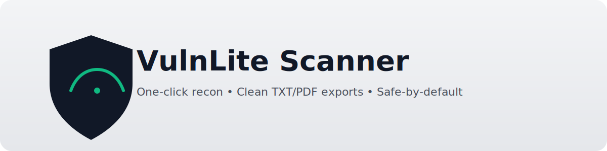

<p align="center">
  
</p>

<p align="center">
  <a href="https://github.com/adam-zs/VulnLiteScanner"></a>
  
  
  <a href="https://github.com/RedSecurity/swit-scanner"></a>
</p>


A single-file, GUI-based recon & report generator inspired by swit-scanner. **No external Python dependencies**: runs with stock Python 3.8+ (Tkinter included). Exports a clean **TXT** and a stylish **PDF** (with margins, padding, and big section bars).

> ⚠️ Use only with written authorization and within a defined scope (Rules of Engagement).


## Features
- **GUI (Tkinter)** with live log console, progress bar, theme toggle
- **Threaded scans** (no freezing)
- **Simulate Mode** for safe demos (works even if CLI tools are missing)
- **Deep Scan**: auto-detects installed tools and captures their snippets
- **Exports**: TXT & PDF (readable spacing, padded blocks, wrapped lines)
- **Heuristic tags**: quick hints (High/Med/Info) that help triage

### External tools (auto-detected if installed)
`whois, whatweb, subfinder, wafw00f, a2sv, dnsenum, sqlmap, wpscan, goofile, ffuf, photon, hakrawler, nmap, nikto`

VulnLite still runs fully in **Simulate** if none are installed.

## Quick Start
```bash
python3 vulnlite/VulnLiteScanner.py
```
1. Enter a target (domain/IP or URL)
2. Toggle **Simulate** or **Deep Scan**
3. Click **Start Scan**
4. Export **TXT** or **PDF**

### Portable
- No `pip install` needed; uses only Python stdlib.
- Works best on Linux (tested on Kali).

## Ethical Use
- Respect laws and contracts.
- Scan only with **explicit written authorization**.
- Sanitize PII and handle logs securely.

## Folder Structure
```
VulnLite-Release/
├─ vulnlite/
│  └─ VulnLiteScanner.py
├─ docs/
│  ├─ RUNBOOK.md
│  ├─ SOP.md
│  ├─ SECURITY.md
│  └─ ROE_TEMPLATE.md
├─ examples/
│  ├─ commands.md
│  └─ simulate_quick.txt
├─ assets/
│  └─ screenshot_gui_placeholder.png
├─ .gitignore
├─ LICENSE
└─ README.md
```
**Credits:** Inspired by [swit-scanner](https://github.com/RedSecurity/swit-scanner).  
**Author:** [Adam-ZS](https://github.com/Adam-ZS) — built for my Summer 2025 cybersecurity internship.


